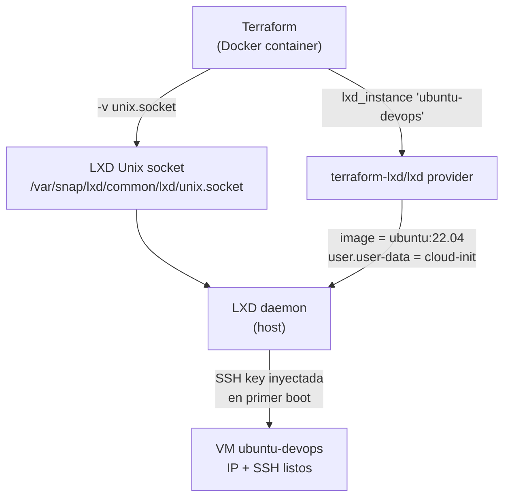
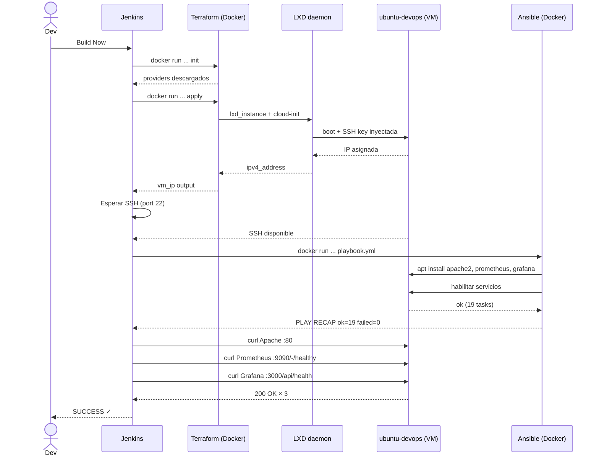

# Lab DevOps (LXD): Terraform + Ansible + Jenkins con Docker
### LXD · Ubuntu Server · Apache · Prometheus · Grafana

Versión automatizada del lab. LXD descarga la imagen, inyecta la clave SSH
via cloud-init y devuelve la IP directamente. Sin plantillas, sin APIs de terceros.

---

## Prerrequisitos

- **LXD** instalado e inicializado (una vez por máquina):

```bash
sudo snap install lxd && sudo lxd init
sudo usermod -aG lxd $USER  # cerrar sesión y volver a entrar
bash scripts/01-setup-lxd.sh
```

- **Docker**

---

## Arrancar

```bash
docker compose up -d
```

La clave SSH se genera automáticamente en `./ssh/` al primer arranque. El pipeline ya está precargado en Jenkins — solo hay que ejecutarlo.

El job se llama `lab-devops-lxd` y está disponible en [http://localhost:8080](http://localhost:8080) en cuanto Jenkins termine de arrancar.


---

## Cómo funciona el contenedor Terraform con LXD

Solo necesita el socket Unix de LXD montado. Sin `--privileged`, sin APIs HTTP:



---

## Flujo del pipeline



---

## Destruir

```bash
docker run --rm \
  -v /var/snap/lxd/common/lxd/unix.socket:/var/snap/lxd/common/lxd/unix.socket \
  -v $(pwd)/terraform:/terraform \
  -w /terraform \
  -e TF_VAR_ssh_public_key="$(cat ~/.ssh/id_rsa.pub)" \
  lab-lxd-terraform:latest destroy -auto-approve
```

O directamente: `lxc delete ubuntu-devops --force`

---
