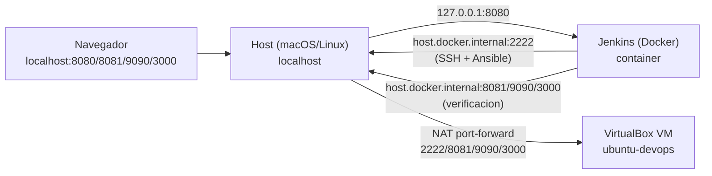
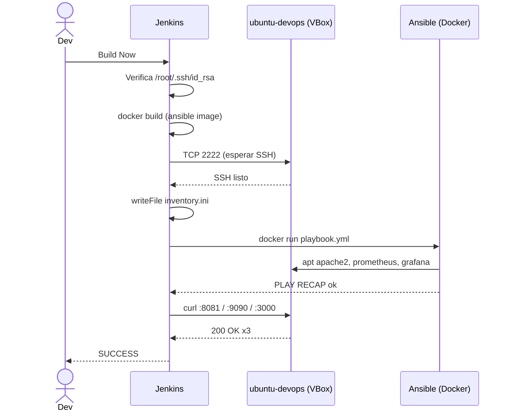

# Lab DevOps (VirtualBox): Vagrant + Ansible + Jenkins con Docker
### VirtualBox · Ubuntu Server · Apache · Prometheus · Grafana

Versión adaptada del lab para VirtualBox. Vagrant descarga la box
`ubuntu/jammy64` (ya viene con SSH listo, sin cloud-init) y NAT/port-forwarding
expone los servicios en el `localhost` del host.

---

## Prerrequisitos

- **VirtualBox 7.x** y **Vagrant** instalados:

```bash
# macOS
brew install --cask virtualbox virtualbox-extension-pack vagrant

# Debian/Ubuntu
sudo apt install virtualbox vagrant
```

- **Docker Desktop** (macOS/Windows) o **Docker Engine + compose v2** (Linux).

> **Nota macOS Apple Silicon (M1/M2/M3):** VirtualBox tiene soporte ARM aún
> experimental y la box `ubuntu/jammy64` es x86_64. Para validar el lab,
> ejecútalo en un host Intel/AMD64. En Apple Silicon, considera UTM/Parallels
> con una box ARM equivalente.

---

## Arrancar

Un solo comando bootstrapea todo (clave SSH, VM, Jenkins):

```bash
bash scripts/01-setup-virtualbox.sh
```

El script:

1. Comprueba que `VBoxManage`, `vagrant` y `docker compose` están en PATH.
2. Genera `./ssh/id_rsa` si no existe (clave compartida host ↔ Jenkins ↔ VM).
3. `vagrant up` — descarga la box, arranca la VM, inyecta la clave pública.
4. `docker compose up -d --build` — levanta Jenkins.

Cuando termine, abre [http://localhost:8080](http://localhost:8080) y lanza el
job `lab-devops-virtualbox` (ya precargado).

---

## Topología de red



Port-forwards de VirtualBox (definidos en `Vagrantfile`):

| Servicio   | Guest | Host   |
|------------|-------|--------|
| SSH        | 22    | 2222   |
| Apache     | 80    | 8081   |
| Prometheus | 9090  | 9090   |
| Grafana    | 3000  | 3000   |

---

## Flujo del pipeline



---

## Operativa

- **Acceder por SSH a la VM:**
  ```bash
  ssh -i ssh/id_rsa -p 2222 vagrant@localhost
  ```

- **Reiniciar la VM** (sin destruirla):
  ```bash
  vagrant reload
  ```

- **Destruir todo:**
  ```bash
  docker compose down
  vagrant destroy -f
  ```

- **Re-bootstrap completo** (tras destruir):
  ```bash
  bash scripts/01-setup-virtualbox.sh
  ```

---

## Estructura

```
.
├── Vagrantfile              # VM Ubuntu via VirtualBox + provisioner SSH
├── Jenkinsfile              # Pipeline: build, SSH wait, Ansible, verify
├── docker-compose.yml       # Jenkins en contenedor
├── scripts/
│   └── 01-setup-virtualbox.sh
├── docker/
│   ├── Dockerfile.jenkins
│   ├── Dockerfile.ansible
│   └── entrypoint.sh
├── ansible/
│   ├── ansible.cfg
│   └── playbook.yml
├── jenkins/
│   └── init.groovy.d/       # job lab-devops-virtualbox precargado
└── ssh/                     # claves generadas por el setup script
```
